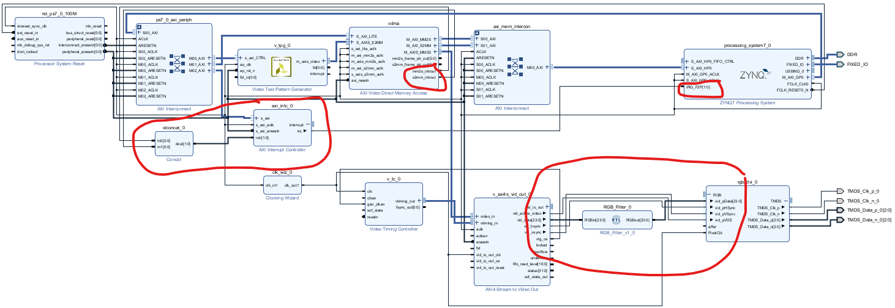
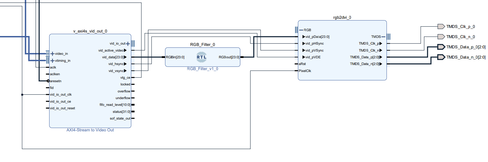

# Pynq Game ([Pynq-Z2-Video](Pynq-Z2-Video))  

## Demo ([Youtube](https://www.youtube.com/watch?v=4u5uUDjD0i4))

## Vivado Project ([Hardware Design](Pynq-Z2-Video))

This project is a modified hardware implementation based on a tutorial from [this GitHub repository](https://github.com/xflorentw/Pynq-Z2-Video). The tutorial focuses on using the HDMI interface of the Pynq-Z2 by creating a block design in Vivado and running the associated code in Vitis.

### Modifications and Optimizations
While the original tutorial served as a foundation, we made specific adjustments to meet our requirements:

- **Resolution Adjustment**: The was based in a resolutoin that was no longer suported by vivado so we switched to 1280 * 720.  
- **Timing Adjustment**: To be able to send 720p Video the timing of `PixelCLK` needed to change to 74.25 MHZ.  

### Design Overview
Below is a complete schematic of the updated design, including the adjusted timing and resolution settings:  


## Game Implementation ([Server + Video Output](Pynq-Z2-Video/vitis/UDP_Server/src))  

For the game implementation, we chose Tetris, with the `PYNQ-Z2` handling player input, game logic, and video output.

### FreeRTOS

To ensure smooth operation, FreeRTOS was implemented as the operating system (`OS`). This allows for task scheduling and prioritization as needed. The game can be divided into three main components: player input (UDP server), game logic, and visualization.

#### UDP Server ([Code](Pynq-Z2-Video/vitis/UDP_Server/src/udp_perf_server.c))  

The UDP server is set up to receive two types of commands: **movement commands** and **block commands**.  

- **Movement Commands**: These commands are sent by the player client and include actions like `Rotate`, `Left`, `Down`, and `Right`.  

- **Block Commands**: These commands come from a "god" client and define the upcoming blocks, such as `Line`, `J`, `L`, `Square`, `S`, `T`, and `Z`.  

Both types of commands are sorted into their respective queues so that the game logic can process them when needed.  

#### Game Logic ([Code](Pynq-Z2-Video/vitis/UDP_Server/src/tetris))  

We developed a custom Tetris library to handle game logic. The library defines block types, initializes the game, and runs the game logic. For ease of testing, the library is cross-compatible with Windows, allowing game logic to be tested independently of the `PYNQ-Z2` hardware.

#### Visualization  

At this stage, the game state is sent via a queue to the visualization task. This task draws the current game state on the screen. Since the game logic must always run before rendering, visualization is given the lowest priority in FreeRTOS.  

## Python Code ([Client](Movement.py))
This Python client captures keyboard inputs and sends them to the server via UDP to control the game.  

### Key Features  
- **Keyboard Input**: Listens for keypresses (`w`, `a`, `s`, `d`) and maps them to game actions like `Rotate`, `Left`, `Down`, and `Right`.  
- **UDP Communication**: Sends the mapped actions to the server using the provided IP and port.  
- **Exit Condition**: Pressing `q` stops the client.  

### Usage  
1. Install the required Python library with:  
   ```bash
   pip install keyboard
   ```
2. Replace the UDP_IP and UDP_PORT with the target server details in the script.
    ```py
    # UDP configuration
    UDP_IP = "192.168.x.xxx"  # Replace with the target IP address
    UDP_PORT = 5001          # Replace with the target port
    ```
    
# RTSP to HDMI Hardware filter PYNQ Z2 ([Pynq-Z2-HDMI-Filter](Pynq-z2-HDMI-Filter))  
## Demo ([Youtube](https://www.youtube.com/watch?v=EgmVjxT6fgA&t))

## Vivado Project ([Hardware Design](Pynq-z2-HDMI-Filter/HDMI-Filter))  
This project builds on the Pynq Game project, with some modifications to suit the requirements of this application:  
- **VDMA Interrupts**: Interrupts from the `VDMA` are connected to the `processing_system_7_0`. This ensures proper recognition of the VDMA by the PYNQ board.  
- **Hardware Filter**: An additional IP block is inserted between `v_axi4s_vid_out_0` and `rgb2dvi_0` to implement a hardware-based video filter.  

  

## Hardware Filter ([Code](Pynq-z2-HDMI-Filter/RGB_Filter.vhd))  
The hardware filter is a VHDL module designed to process RGB video data. 
- **Input**: Receives 24-bit RGB data (`RGBin`).  
- **Output**:  
  - The red channel (8 bits) is preserved from the input.  
  - The green and blue channels (16 bits) are set to zero, resulting in a red-filtered output.

  

## Jupyter Notebook ([Code](Pynq-z2-HDMI-Filter/FullColorXSA_AXI.ipynb))  
This Jupyter Notebook demonstrates the integration of hardware and software on the Pynq platform. It enables hardware-accelerated video processing, handles an RTSP video stream, and manages data transfer using the VDMA.  

### Key Highlights  
1. **Overlay Setup**:  
   - Loads the FPGA bitstream (`Interupt_Red_Filter.xsa`).  
   - Provides details about the overlay, including IP blocks, hierarchies, and memory configurations.  

2. **VDMA Configuration**:  
   - Initializes the VDMA and configures frame buffers to handle video data.  
   - Sets up `HSIZE` and `VSIZE` to match image dimensions.  

3. **RTSP Stream Handling**:  
   - Captures video frames from an RTSP stream.  
   - Resizes frames to match VDMA dimensions and stores them in a hardware-allocated buffer. 
